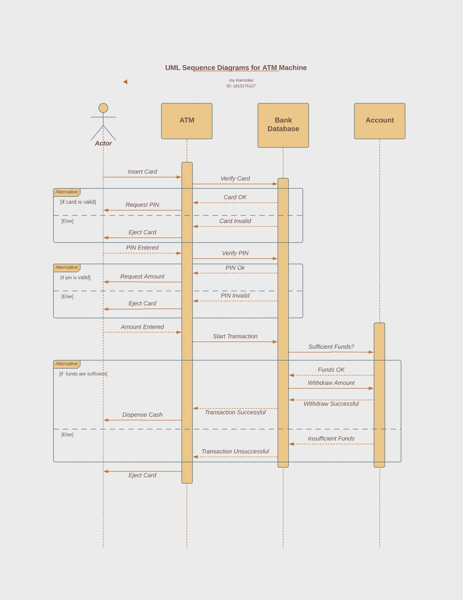

# UML Sequence Diagram for ATM Machine

## System Description

An automated teller machine (ATM) is a self-service banking machine that allows customers to perform basic banking transactions without the need for a human teller. ATM machines are typically located in banks, shopping malls, and other public places.

## Sequence Diagram

The following sequence diagram shows a typical ATM withdrawal transaction:

- **Actor:** Customer
- **ATM:** Automated Teller Machine
- **Bank Database:** Bank's database of customer accounts

1. Customer inserts card into ATM.
2. ATM reads card information and verifies with the bank database.
3. ATM prompts the customer to enter a PIN.
4. Customer enters the PIN.
5. ATM verifies the PIN with the bank database.
6. Customer enters the withdrawal amount.
7. ATM verifies that the customer has sufficient funds in the account.
8. ATM dispenses cash.
9. Customer takes the cash.
10. ATM returns the card.

## Operating Process

To use an ATM machine, customers typically follow these steps:

1. Insert their bank card into the ATM.
2. Enter their PIN when prompted.
3. Select the transaction type they want to perform (e.g., withdrawal, deposit, balance inquiry).
4. Follow the instructions on the ATM screen to complete the transaction.
5. Take their card and cash (if applicable).

## Technical Report

### Introduction

An automated teller machine (ATM) is a self-service banking machine that allows customers to perform basic banking transactions without the need for a human teller. ATM machines are typically located in banks, shopping malls, and other public places.

### UML Sequence Diagram

The above sequence diagram shows a typical ATM withdrawal transaction. The customer inserts their card into the ATM, enters their PIN, selects the withdrawal transaction type, and enters the amount they want to withdraw. The ATM then verifies that the customer has sufficient funds in their account and dispenses the cash.

## Operating Process

To use an ATM machine, customers typically follow these steps:

- Insert their bank card into the ATM.
- Enter their PIN when prompted.
- Select the transaction type they want to perform (e.g., withdrawal, deposit, balance inquiry).
- Follow the instructions on the ATM screen to complete the transaction.
- Take their card and cash (if applicable).

## Conclusion

ATM machines are a convenient and efficient way for customers to perform basic banking transactions. They are also relatively secure, as they use a variety of security measures to protect customer data.

## Additional Remarks

In addition to the withdrawal transaction shown in the sequence diagram above, ATM machines can also be used to perform other transactions such as deposits, balance inquiries, and fund transfers. Some ATM machines also offer additional features such as bill payment and check cashing. ATM machines are an important part of the modern banking system. They provide customers with a convenient way to access their bank accounts and perform basic banking transactions 24/7.
