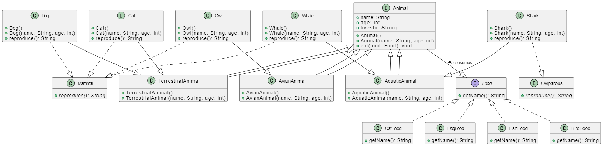

# Pet Management System - README

## Overview

This Java project implements a Pet Management System using Object-Oriented Programming (OOP) concepts. The system simulates a variety of animals, their habitats, and the food they eat. It showcases inheritance, polymorphism, encapsulation, and interfaces in Java.

## Project Structure

The project consists of several classes organized in a hierarchical manner:

### Animal Class

- The base class for all animals.
- Contains instance variables for `name`, `age`, and `livesIn` habitat.
- Provides constructors for initializing these variables.
- Defines an `eat` method that takes a `Food` object as a parameter to simulate the animal's eating behavior.

### TerrestrialAnimal, AquaticAnimal, and AvianAnimal Classes

- Inherited from the `Animal` class, these represent animals living in different habitats: land, water, and trees, respectively.
- Each class has constructors to set the `livesIn` habitat.
- Demonstrates inheritance as they inherit properties and methods from the `Animal` class.

### Mammal and Oviparous Interfaces

- Interfaces that define common behaviors for animals that reproduce differently: mammals give birth to live young, while oviparous animals lay eggs.
- Both interfaces have a `reproduce` method that returns the birth type, showcasing encapsulation.

### Dog and Cat Classes:

   - Both `Dog` and `Cat` classes represent terrestrial animals, which are animals that live on land.
   - They extend the `TerrestrialAnimal` class, which is the appropriate habitat class for land-dwelling animals.
   - Additionally, they both implement the `Mammal` interface. This is because dogs and cats are mammals, and mammals are known for giving birth to live young (viviparous reproduction).
   - The implementation of the `reproduce` method in both classes reflects their specific reproductive method, which is giving birth to live offspring.
   - The use of the `Mammal` interface allows us to treat both dogs and cats uniformly when dealing with their reproductive behavior, even though they are different species.

### Shark and Whale Classes:

   - `Shark` and `Whale` classes represent aquatic animals, which are animals that live in water.
   - They extend the `AquaticAnimal` class, which is the appropriate habitat class for aquatic animals.
   - `Shark` implements the `Oviparous` interface, while `Whale` implements the `Mammal` interface.
   - This is because sharks are typically oviparous, meaning they lay eggs, while whales are mammals, which means they give birth to live young.
   - The `reproduce` method in each class reflects their specific reproductive methods. Sharks return "From Egg," and whales return "Not From Egg."
   - By using the appropriate interfaces, we can handle their reproductive behavior correctly based on their species-specific characteristics.

### Owl Class:

   - The `Owl` class represents an avian animal, which is a bird.
   - It extends the `AvianAnimal` class, which is the appropriate habitat class for birds that live in trees.
   - Similar to the `Dog` and `Cat` classes, the `Owl` class implements the `Mammal` interface.
   - While birds are not mammals, this demonstrates polymorphism and how interfaces can be used to model common behaviors. The `reproduce` method in the `Owl` class reflects the bird's specific reproductive method.

In summary, the `Dog`, `Cat`, `Shark`, `Whale`, and `Owl` classes demonstrate polymorphism by implementing the appropriate habitat class and interfaces based on their specific characteristics. This design allows for a unified approach to handling their behaviors while accommodating the differences in their habitats and reproduction methods. It's an example of how object-oriented programming enables you to model real-world relationships and behaviors in a structured and extensible way.

### Food Interface and Food Classes

- The `Food` interface defines a common method `getName` for all types of food.
- Four classes (`CatFood`, `DogFood`, `FishFood`, and `BirdFood`) implement the `Food` interface, providing specific implementations for each type of food.

## Main Class

The `Main` class in this project is the central point of execution. It orchestrates the creation of instances of animals and food items, demonstrating various aspects of how animals eat, live in their habitats, and showcase their reproduction types. Below, we describe the functionality of the `Main` class in detail:

### Entry Point

The `Main` class is the starting point of the application's execution. When you run the application, it is this class that gets executed first.

### Object Creation

1. **Food Item Creation:**

   - The `Main` class begins by creating instances of different types of food items. These food items are implemented as classes that implement the `Food` interface: `FishFood`, `DogFood`, `CatFood`, and `BirdFood`.

   - Each food item represents a specific type of food suitable for different animals. For example, `FishFood` is suitable for aquatic animals, `DogFood` for dogs, `CatFood` for cats, and `BirdFood` for avian animals like owls.

2. **Animal Creation:**

   - Next, the `Main` class creates instances of various animals, including `Dog`, `Cat`, `Whale`, `Shark`, and `Owl`.

   - These animal instances are created with specific names and, in some cases, ages, as specified in the code.

   - The creation of these animal instances demonstrates how objects can be instantiated from classes that inherit from the `Animal` class and how they can carry unique characteristics and properties.

### Demonstration of Animal Behavior

1. **Eating Behavior:**

   - The `Main` class simulates animal behavior by having each animal instance call the `eat` method, passing the appropriate food item as an argument.

   - For instance, a `Dog` object eats `DogFood`, a `Cat` object eats `CatFood`, and so on.

   - This demonstrates the use of polymorphism, as the same `eat` method in the `Animal` class can handle different types of food items and display how each animal eats its specific food.

2. **Habitat Information:**

   - The `Main` class also displays information about each animal's habitat using the `livesIn` variable.

   - For example, it prints out statements like "[Animal name] lives on [habitat]" to indicate where each animal resides.

   - This showcases how inheritance is utilized, as the `livesIn` variable is defined in the base `Animal` class and inherited by all animal subclasses.

3. **Reproduction Type:**

   - Another important aspect demonstrated in the `Main` class is the reproduction type of each animal.

   - By calling the `reproduce` method on each animal instance, it showcases whether the animal gives birth to live young or comes from an egg, as determined by their respective classes and interfaces.

### Summary

In summary, the `Main` class serves as the driver of the application, showcasing the key OOP concepts of inheritance, polymorphism, encapsulation, and the use of interfaces. It creates instances of animals and food items, simulating how animals interact with their environments and food. By displaying habitat information and reproduction types, it provides a comprehensive overview of how these OOP concepts come together to model a pet management system. This class demonstrates how real-world scenarios can be represented in a structured and object-oriented manner in Java.

## How to Use

1. Compile all Java files in your IDE or using the command line.
2. Run the `Main` class to see the simulation in action.
3. Observe how different animals interact with their specific types of food and habitats.

## Polymorphism

Polymorphism is demonstrated in this project through the following ways:

1. **Method Overriding**: Each animal class overrides the `reproduce` method from the respective interface, allowing different implementations based on the animal's reproduction type.

2. **Use of Interfaces**: The `Mammal` and `Oviparous` interfaces provide a common contract for animals with different reproduction methods, allowing them to be treated uniformly.

3. **Constructor Overloading**: Several classes have multiple constructors to accommodate different ways of initializing objects, illustrating polymorphism in constructor overloading.

## Class Relationships

- `Animal` is the base class for all animal types.
- `TerrestrialAnimal`, `AquaticAnimal`, and `AvianAnimal` inherit from `Animal`.
- `Dog`, `Cat`, `Shark`, `Whale`, and `Owl` inherit from the respective habitat class and implement `Mammal` or `Oviparous`.
- `Mammal` and `Oviparous` are interfaces defining common behavior.
- `Food` interface and food classes are used for feeding animals based on their types.

## UML Diagram
Below is a UML diagram representing the project's class structure:

## Conclusion

This project demonstrates key OOP concepts such as inheritance, polymorphism, encapsulation, and the use of interfaces in a practical scenario. It models a pet management system where different animals interact with their environments and food. Understanding these concepts is essential for designing robust and maintainable software systems.